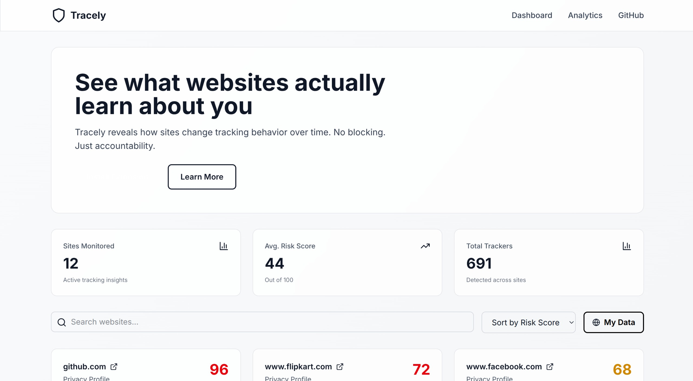
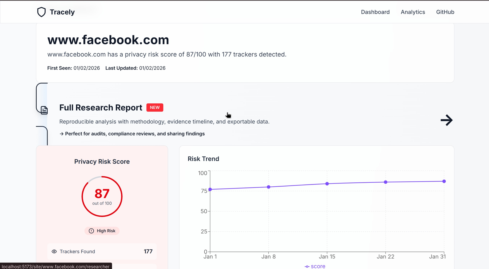
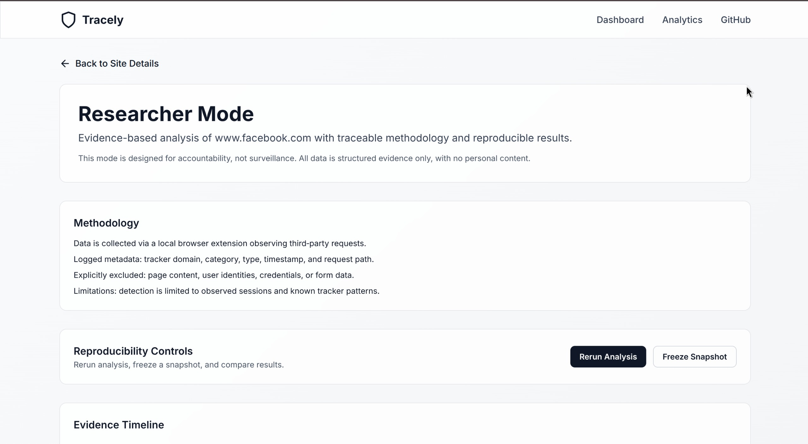
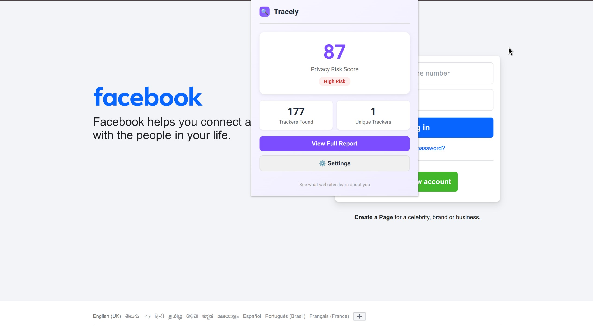
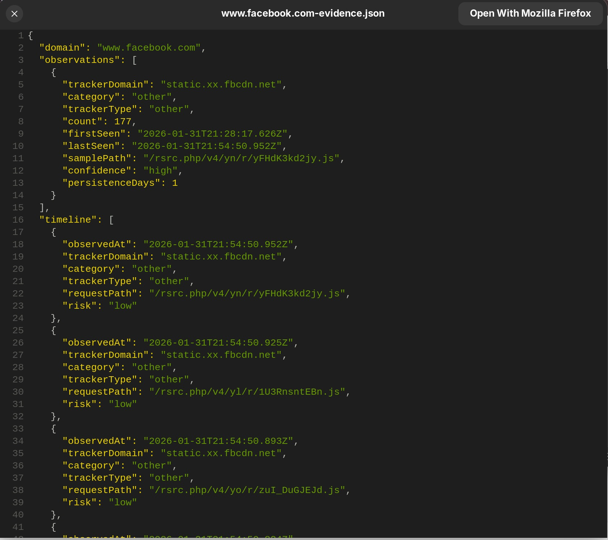

# Tracely



**Most tools protect users. Ours creates evidence.**

Tracely is an extension-based browser platform for investigating third-party tracking across websites. Designed for regulators, researchers, journalists, and compliance teams—it transforms raw tracker detections into traceable, reproducible evidence.

## 🚀 Live Demo

**Dashboard**: [https://tracely-pi.vercel.app](https://tracely-pi.vercel.app)

Try the live demo to explore real tracking data, view analytics, and see full research reports in action!

## 🎥 Tutorial Video

Watch our comprehensive tutorial to learn how to use Tracely's extension and dashboard:

[https://github.com/rj9884/Tracely/Public/tutorial.mp4
](https://github.com/rj9884/Tracely/blob/main/Public/tutorial.mp4)
The tutorial covers:
- Installing and setting up the browser extension
- Navigating the dashboard and understanding privacy scores
- Viewing detailed site analysis and tracker information
- Using the Analytics page to explore tracking patterns
- Accessing Full Research Reports with evidence timelines
- Exporting data for audits and compliance
- Switching between "My Data" and "Global Stats" modes

## What It Does

### For Privacy Professionals
- **See what's tracking you** - Real-time detection of third-party trackers, pixels, and analytics
- **Understand the ecosystem** - Cross-site tracking relationships and data flows
- **Export evidence** - Structured data exports (JSON, CSV) for audits and investigations
- **Reproduce findings** - Freeze snapshots and compare changes over time

### For Compliance & Audits
- **Full Research Reports** - Methodology disclosure, evidence timelines, confidence scoring
- **Audit-ready exports** - Download structured evidence for regulatory submissions
- **Reproducible analysis** - Every finding is timestamped and replayable
- **Neutral language** - Focus on what's observed, not assumptions

## Key Features

### 🔍 Dashboard
- Site privacy risk scores (0-100)
- Quick overview of tracker ecosystem
- Risk trends over time
- Multi-site comparison
- **Hybrid Data Mode** - Toggle between "My Data" (personal observations) and "Global Stats" (aggregated insights)
- Search, filter, and sort capabilities

### 📊 Analytics Page

*Analytics page: top trackers and distribution charts.*
- **Top Trackers** - Visual list with horizontal progress bars showing relative sighting frequency
- **Tracker Distribution Chart** - Bar chart visualization of top 10 trackers with accented gradient design
- **Key Insights** - Curated analysis of tracker growth, analytics dominance, cross-site tracking, and high-risk activity
- **Statistics Cards** - Unique trackers count, total sightings, and high-risk tracker count

### 📊 Site Analysis
- Privacy risk breakdown
- Tracker list with categories
- Historical trend visualization
- Compliance recommendations

### 📋 Full Research Reports

*Evidence timeline and detailed findings from captures.*
- **Evidence Timeline** - All observed trackers with timestamps
- **Reproducibility Controls** - Rerun analysis, freeze snapshots, compare results
- **Methodology Disclosure** - What data we collect, what we exclude, limitations
- **Raw Data Access** - Export JSON, CSV, or structured audit reports
- **Confidence Scoring** - Track sighting counts (high ≥50, medium ≥10, low <10)
- **Persistence Metrics** - Days active, first seen, last seen

### 🌐 Browser Extension

*Extension popup UI for quick site inspection.*
- Passive observation of HTTP/HTTPS requests
- Automatic tracker categorization
- Real-time event logging
- Privacy-first (no content capture, no identifiers)
- Seamless data sync to dashboard

## Hybrid Data Mode

Tracely supports a **hybrid approach** so users can view both personal observations and aggregated global insights.

### How It Works
- **Personal Data**: Trackers detected during your own browsing
- **Global Stats**: Aggregated tracking data from all users (no individual identity or browsing history)

### User Experience
- **My Data** (default): shows only your detected trackers and sites
- **Global Stats**: shows anonymized, aggregated patterns across all users
- Toggle modes directly on the Dashboard

### API Behavior
- Personal data (requires auth):
	- `GET /sites`
	- `GET /site/:domain/details`
	- `GET /site/:domain/evidence`
- Global data (no auth):
	- `GET /sites/global/stats`

### Data Privacy
- User identities are never exposed
- Personal browsing habits remain private
- Global stats are aggregate-only

### Implementation Notes
- Models include `userId` on events and sites
- Queries are indexed by `(userId, domain)` for performance
- If not authenticated, the system defaults to global stats

### Future Enhancements
- Per-tracker global analytics and correlations
- Time-series trends and risk heatmaps
- Researcher dashboards with exportable global reports

## Quick Start

See [QUICKSTART.md](QUICKSTART.md) for detailed setup instructions.

### 60-Second Setup

```bash
# Backend (Node.js + MongoDB)
cd backend
npm install
npm run dev

# Frontend (React + Vite)
cd ../frontend
npm install
npm run dev

# Extension (load in Chrome)
# Navigate to chrome://extensions/ → "Load unpacked" → select extension/
```

Then visit `http://localhost:5173`

## Architecture

```
frontend/          React + Vite UI
├── pages/         Dashboard, Site Detail, Analytics, Researcher Mode
├── components/    Reusable UI components (Charts, TrackerList, SiteCard, etc.)
├── hooks/         Custom data-fetching hooks (useApi, useSites, useTrackers)
└── utils/         API client

backend/           Express.js API + MongoDB
├── routes/        API endpoints (sites, trackers, events, analytics, auth)
├── models/        Mongoose schemas (Site, Tracker, Event, User)
├── middleware/    Auth, validation
└── utils/         Helpers, database utilities

extension/         Chrome extension
├── background/    Service worker (message passing)
├── content/       Content script (XHR/Fetch interception)
├── popup/         UI for extension popup
└── utils/         Shared utilities
```

## Core Workflows

### For Auditors
1. Add site to dashboard (or use extension to auto-detect)
2. Run extension on target site
3. Navigate to **Full Research Report**
4. Review evidence timeline and confidence scores
5. Download audit report for submission

### For Researchers
1. Visit site with extension active
2. Collect observations over time
3. Review data in **Analytics** page to understand tracker distribution
4. Freeze snapshot as baseline
5. Rerun analysis to detect changes
6. Compare snapshots to identify new trackers

### For Compliance Teams
1. Toggle to **Global Stats** to see aggregated tracker trends
2. Export evidence (JSON/CSV)
3. Share with stakeholders
4. Maintain audit trail (all reports timestamped)
5. Review methodology documentation

## Data Privacy


*Site metadata and request details captured for evidence.*

✅ **What we collect:**
- Third-party domain names
- Request timestamps
- HTTP headers (User-Agent, Referer, etc.)
- Request paths

❌ **What we explicitly exclude:**
- Page content or HTML
- Form data or credentials
- User identities or personal data
- First-party site data (beyond domain name)

All data stays in your browser extension and local database. No cloud sync.

## Technical Stack

- **Frontend**: React 18, Vite, Tailwind CSS, Recharts (data visualization), Lucide React (icons)
- **Backend**: Node.js, Express.js, Mongoose
- **Database**: MongoDB (with hybrid user/global data support)
- **Extension**: Chrome/Chromium (Manifest v3)
- **Auth**: Session-based (optional for personal data tracking)

## Project Status

This is a **complete, functional MVP** ready for production use:
- ✅ Real tracker detection with categorization
- ✅ Evidence-based reporting with full methodology
- ✅ Reproducible analysis with snapshots
- ✅ Audit-ready exports (JSON, CSV)
- ✅ Full methodology disclosure
- ✅ Hybrid data mode (personal + global statistics)
- ✅ Interactive data visualizations
- ✅ Professional UI with accented design

## Documentation

- **[QUICKSTART.md](QUICKSTART.md)** - Setup and first steps

## License
ISC
---
