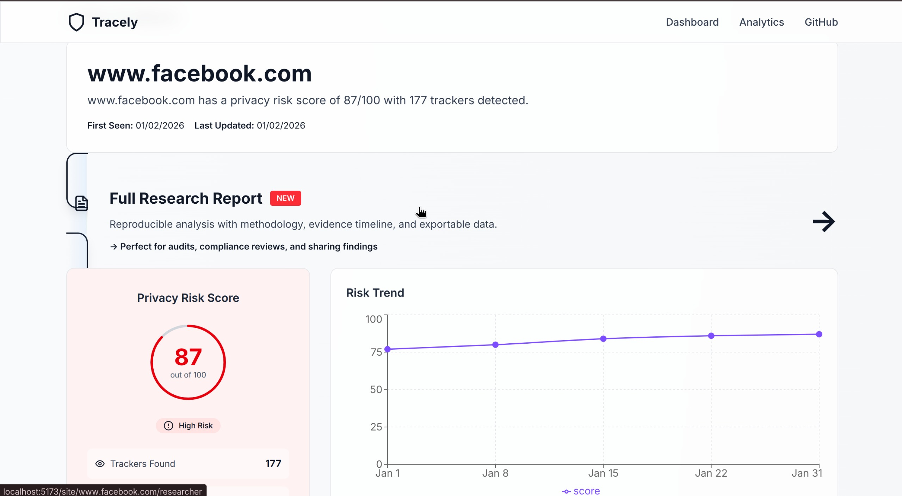
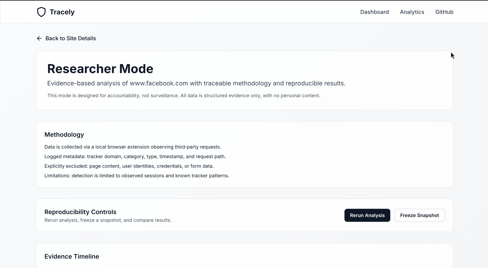
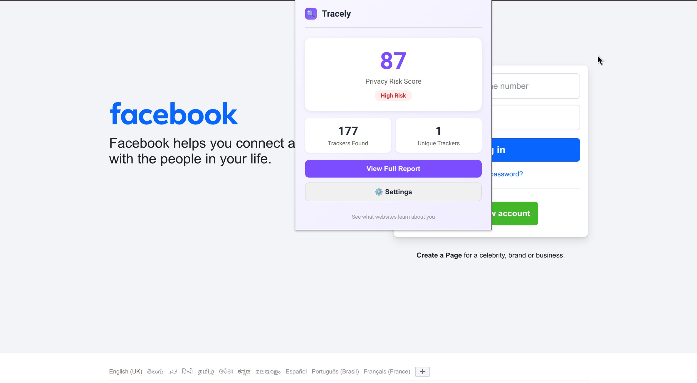
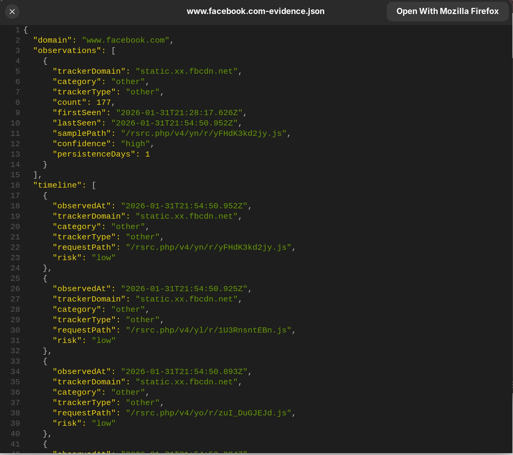

# Tracely

Firefox Add-on: https://addons.mozilla.org/addon/tracely/


Most tools protect users. Ours creates evidence.

Tracely is an extension-based browser platform for investigating third-party tracking across websites. Designed for regulators, researchers, journalists, and compliance teams, it transforms raw tracker detections into traceable, reproducible evidence.

## Live Demo

Dashboard: [https://tracely-phi.vercel.app](https://tracely-phi.vercel.app)

Try the live demo to explore real tracking data, view analytics, and see full research reports in action.

## Tutorial Video

Watch the comprehensive tutorial to learn how to use Tracely's extension and dashboard:

[https://github.com/rj9884/Tracely/Public/tutorial.mp4](https://github.com/rj9884/Tracely/blob/main/Public/tutorial.mp4)

The tutorial covers:
- Installing and setting up the browser extension
- Navigating the dashboard and understanding privacy scores
- Viewing detailed site analysis and tracker information
- Using the Analytics page to explore tracking patterns
- Accessing Full Research Reports with evidence timelines
- Exporting data for audits and compliance
- Switching between "My Data" and "Global Stats" modes

## Core Capabilities

### For Privacy Professionals
- See what is tracking you: Real-time detection of third-party trackers, pixels, and analytics.
- Understand the ecosystem: Cross-site tracking relationships and data flows.
- Export evidence: Structured data exports (JSON, CSV) for audits and investigations.
- Reproduce findings: Freeze snapshots and compare changes over time.

### For Compliance and Audits
- Full Research Reports: Methodology disclosure, evidence timelines, and confidence scoring.
- Audit-ready exports: Download structured evidence for regulatory submissions.
- Reproducible analysis: Every finding is timestamped and replayable.
- Neutral language: Focus on what is observed, avoiding speculation.

## Key Features

### Dashboard
- Site privacy risk scores (0-100)
- Quick overview of tracker ecosystem
- Risk trends over time
- Multi-site comparison
- Hybrid Data Mode: Toggle between "My Data" (personal observations) and "Global Stats" (aggregated insights)
- Search, filter, and sort capabilities

### Analytics Page

*Analytics page: top trackers and distribution charts.*
- Top Trackers: Visual list with horizontal progress bars showing relative sighting frequency
- Tracker Distribution Chart: Bar chart visualization of top 10 trackers with accented gradient design
- Key Insights: Curated analysis of tracker growth, analytics dominance, cross-site tracking, and high-risk activity
- Statistics Cards: Unique trackers count, total sightings, and high-risk tracker count

### Site Analysis
- Privacy risk breakdown
- Tracker list with categories
- Historical trend visualization
- Compliance recommendations

### Full Research Reports

*Evidence timeline and detailed findings from captures.*
- Evidence Timeline: All observed trackers with timestamps
- Reproducibility Controls: Rerun analysis, freeze snapshots, and compare results
- Methodology Disclosure: Explains data collection processes, exclusions, and limitations
- Raw Data Access: Export JSON, CSV, or structured audit reports
- Confidence Scoring: Track sighting counts (high >= 50, medium >= 10, low < 10)
- Persistence Metrics: Days active, first seen, last seen

### Browser Extension

*Extension popup UI for quick site inspection.*
- Passive observation of HTTP/HTTPS requests
- Automatic tracker categorization
- Real-time event logging
- Privacy-first design (no content capture, no identifiers)
- Seamless data sync to dashboard

## Hybrid Data Mode

Tracely supports a hybrid data architecture so users can view both personal observations and aggregated global insights.

### How It Works
- Personal Data: Trackers detected during your own browsing history.
- Global Stats: Aggregated tracking data from all users (devoid of individual identity or browsing history).

### User Experience
- My Data (default): Shows only your detected trackers and sites.
- Global Stats: Shows anonymized, aggregated patterns across all users.
- Toggle modes directly on the Dashboard.

### API Behavior
- Personal data (requires authorization):
  - `GET /sites`
  - `GET /site/:domain/details`
  - `GET /site/:domain/evidence`
- Global data (no authorization required):
  - `GET /sites/global/stats`

### Data Privacy
- User identities are never exposed.
- Personal browsing habits remain private.
- Global stats are aggregate-only.

### Implementation Notes
- Models include `userId` on events and sites.
- Queries are indexed by `(userId, domain)` for performance.
- If not authenticated, the system defaults to global stats.

## Technical Stack

- Frontend: React 18, Vite, CSS, Recharts (data visualization), Lucide React (icons)
- Backend: Node.js, Express.js, Mongoose
- Database: MongoDB (with hybrid user/global data support and compound indexes)
- Extension: Chrome/Chromium (Manifest v3)
- Authorization: Session-based (optional for personal data tracking)

## Quick Start

See [QUICKSTART.md](QUICKSTART.md) for detailed setup instructions.

### Basic Setup

```bash
# Backend (Node.js + MongoDB)
cd backend
npm install
npm run dev

# Frontend (React + Vite)
cd ../frontend
npm install
npm run dev

# Extension (Chrome)
# Navigate to chrome://extensions/ -> Enable "Developer mode" -> Click "Load unpacked" -> Select extension/ directory
```

Then visit `http://localhost:5173`

## Performance and Accuracy Benchmarking

Tracely includes an automated benchmarking and evaluation suite. It tests the accuracy of the browser extension's tracker detection against real-world sites and measures backend telemetry ingestion throughput.

### Running the Measurement Suite

To execute the accuracy and throughput measurements:

1. Navigate to the backend directory:
   ```bash
   cd backend
   ```
2. Run the measurement script:
   ```bash
   node scripts/measure.js
   ```

### Metric Outputs
The benchmark suite evaluates:
1. **Classification Accuracy**: Checks the extension's tracker detection against a ground truth list of 3,500+ tracking domains (crawled live or falling back to a local copy).
2. **False Positive Rate**: Evaluates classification of safe utility CDNs (like Cloudflare, jsDelivr, unpkg, Stripe) to measure false alerts.
3. **Ingestion Throughput**: Benchmarks backend telemetry processing capacity (events processed per second) in-memory versus simulated database write delays.

The results are automatically compiled into a markdown table inside `MEASUREMENT_REPORT.md` at the project root.

---


---

### Benchmark Notes & Variance
* **Throughput Variance**: Measured throughput numbers (events/sec) can vary depending on host system CPU performance, transient resource load, and Node.js garbage collection cycles during the run.
* **Accuracy Constraints**: The accuracy benchmark crawls homepage HTML. Because many trackers load dynamically post-consent and some sites block static scrapers (yielding 403 errors), the exact ratio of trackers to CDNs will depend on active network conditions and page states.

## Project Structure

```
frontend/          React + Vite UI
├── pages/         Dashboard, Site Detail, Analytics, Researcher Mode
├── components/    Reusable UI components (Charts, TrackerList, SiteCard, etc.)
├── hooks/         Custom data-fetching hooks (useApi, useSites, useTrackers)
└── utils/         API client

backend/           Express.js API + MongoDB
├── routes/        API endpoints (sites, trackers, events, analytics, auth)
├── models/        Mongoose schemas (Site, Tracker, Event, User)
├── middleware/    Auth, validation
├── scripts/       Measurement and administrative scripts
└── utils/         Helpers, database utilities

extension/         Chrome extension
├── background/    Service worker (message passing)
├── content/       Content script (XHR/Fetch interception)
├── popup/         UI for extension popup
└── utils/         Shared utilities
```

## Data Privacy


*Site metadata and request details captured for evidence.*

Collected Data:
- Third-party domain names
- Request timestamps
- HTTP headers (User-Agent, Referer, etc.)
- Request paths

Excluded Data:
- Page content or HTML
- Form data or credentials
- User identities or personal data
- First-party site data (beyond domain name)

All data stays in your browser extension and local database. No cloud sync.

## License
MIT
